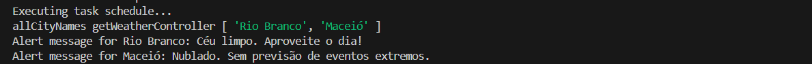

# SIGNAL RAIN

<hr>

<p align="center">
   
</p>


### Tópicos 

- [Project description](#project-description)

- [Functionalities](#functionalities)

- [Technologies used](#technologies-used)

- [Run the project](#run-the-project)

- [Developer](#developer)

---

## Project description

<p align="justify">
 This is an ongoing project, where its ultimate goal is to warn people about possible storms.

Since April 27, cities in Rio Grande do Sul in Brazil have been experiencing a series of environmental catastrophes due to excessive rain.

With this in mind and knowing that in countries like the United States, Canada, among others, it is in addition to the functionality that is ready, where sending the name of the city receives as a result what the weather is like that day, the idea is to develop, after studies, a way of sending alerts to people via SMS, E-Mail, WhatsApp, among other means, about the possibility of storms in the region where they live in Brazil or in any other country.


</p>

---

## Functionalities

:heavy_check_mark: `Feature 1:` Carry out research regarding the climate by city name.

```json
{
  "coord": { "lon": -51.9386, "lat": -23.4253 },
  "weather": [ { "id": 800, "main": "Clear", "description": "clear sky", "icon": "01d" } ],
  "base": "stations",
  "main": {
    "temp": 294.08,
    "feels_like": 293.51,
    "temp_min": 294.08,
    "temp_max": 294.08,
    "pressure": 1016,
    "humidity": 49
  },
  "visibility": 10000,
  "wind": { "speed": 6.17, "deg": 30 },
  "clouds": { "all": 0 },
  "dt": 1718798356,
  "sys": {
    "type": 1,
    "id": 8387,
    "country": "BR",
    "sunrise": 1718791709,
    "sunset": 1718830195
  },
  "timezone": -10800,
  "id": 3457671,
  "name": "Maringá",
  "cod": 200
}
```

:heavy_check_mark: `Feature 2:` Meteorological monitoring work function, currently with static data defining only two cities, and any city can be added.



---

## Technologies used
<div>
  <a href="https://nodejs.org/en" target="_blank">  </a> 

  <a href="https://www.typescriptlang.org/" target="_blank">  </a>

  <a href="https://pnpm.io/" target="_blank">  </a>
</div>

---

## Run the project

After cloning the project, some steps must be followed:

- In order to access and test the code, you must have an API_KEY created at https://openweathermap.org/ and configured in your Environment variables as required in src/config/dotenv.ts.

- Open the project with your preferred editor;
- In the project, PNPM was used as a package manager, so run:
  - pnpm install
- To run the project, use the command:
  - pnpm run dev
- To access Swagger documentation, go to:
  - http://localhost:3000/api-docs
- To test the query by city name, in a testing software of your choice, Postman, Insomnia, etc...
  - Create a collection with the POST method on the route http://localhost:3000/api/weather;
  - In the Body, change it to raw and in JSON format and send the request as follows:
```JSON
{
    "cityName": "Maringá"
}
```

---

# Developer
### Vinícius Staiguer
##### vinistaiguer@gmail.com
